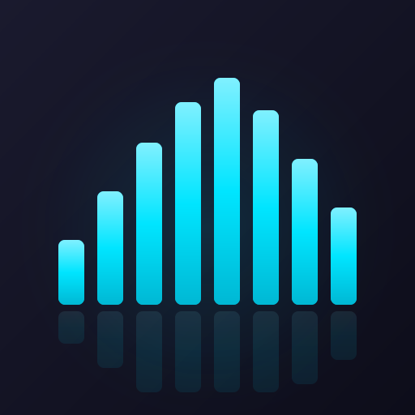

<p align="center">
  
</p>

<h1 align="center">WaveBar</h1>

<p align="center">Real-time audio visualizer for the macOS menu bar.</p>

<p align="center">
  
  
</p>
<p align="center">
  
  
</p>

## Features

- **9 visualization styles** — Bars, Bars (Inverted), Mirror Bars, Wave, Blocks, Line, Circle Blob, Circle Rays, Circle Dots
- **7 color schemes** — Cyan, Purple, Green, Orange, Pink, Rainbow, White
- **Adjustable width** — Extra Narrow / Narrow / Medium / Wide / Extra Wide
- **Sensitivity control** — Low / Medium / High / Max
- **Start at Login** option
- **Menu bar only** — no Dock icon, minimal footprint

## Install

1. Download `WaveBar.dmg` from the [latest release](https://github.com/JulienDeveaux/WaveBar/releases/latest)
2. Open the DMG and drag `WaveBar.app` to your Applications folder
3. Launch WaveBar

> **Troubleshooting:** If macOS blocks the app, open Terminal and run:
> ```bash
> xattr -d com.apple.quarantine /Applications/WaveBar.app
> ```
> This is needed because the app is not notarized with an Apple Developer account.

### Audio permission

On first launch, WaveBar will guide you through granting **System Audio Recording** permission:

1. Go to **System Settings → Privacy & Security**
2. Scroll down to **System Audio Recording** (not Screen Recording!)
3. Click the **+** button at the bottom of the list
4. Find and select `WaveBar.app`, then click Open
5. Make sure the toggle next to WaveBar is **ON**

You can reopen this page anytime from the WaveBar menu → **Check Audio Permissions...**

## Build from source

Requires macOS 15+ and Swift 6.0+ (Command Line Tools or Xcode).

```bash
git clone https://github.com/JulienDeveaux/WaveBar.git
cd WaveBar
chmod +x build.sh
./build.sh
open WaveBar.app
```

## Architecture

| File | Role |
|---|---|
| `main.swift` | App entry point, NSApplication setup, Launch Services registration |
| `AppDelegate.swift` | Menu bar UI, settings menus with live preview, display timer |
| `AudioCaptureManager.swift` | CoreAudio Process Tap + aggregate device setup |
| `AudioAnalyzer.swift` | FFT via Accelerate/vDSP, logarithmic band grouping, auto-normalization |
| `VisualizerView.swift` | Layer-backed NSView rendering all 9 visualization styles |

## License

MIT
